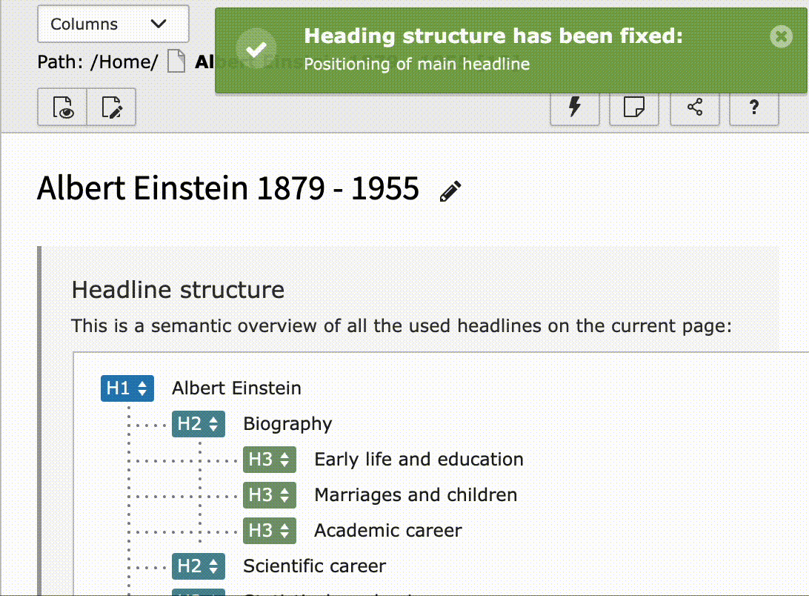
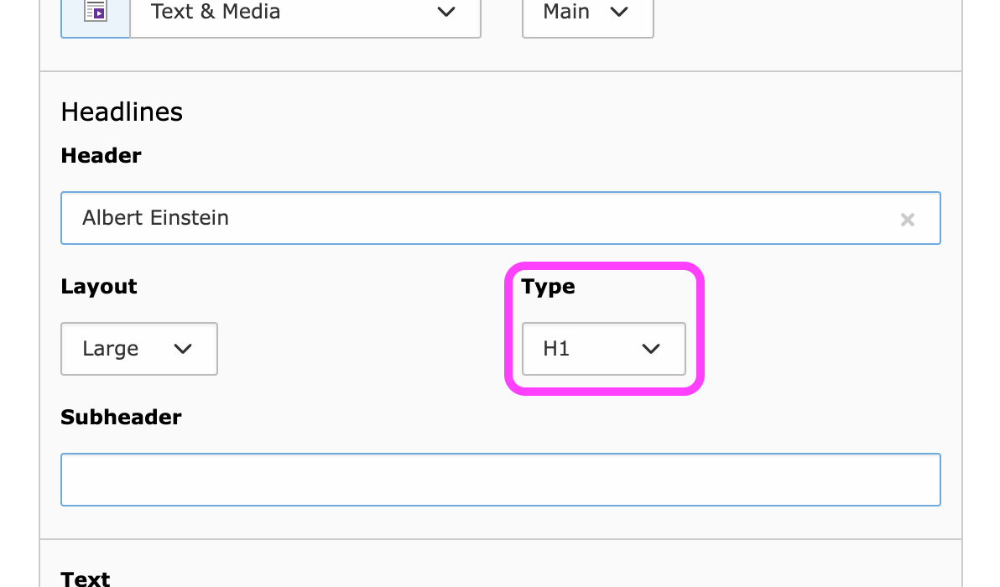

# The Semantilizer

## :question: What is it?

The Semantilizer is a TYPO3 extension, that adds more functionality to the TYPO3 own headlines of content elements. This extension will detach the semantic definition from the field `header_layout` for the headlines of the content elements.
It also adds an overview over all headlines across the current page. This will display also potential errors in the structuring of headlines and gives easy fixing options.



## :wrench: Installation

* Get the extension via composer: `composer require zeroseven/z7-semantilizer`
* Make sure the typoscript setup gets included **after** the configuration of fluid_styled_content to override their partials for the headlines

## :roller_coaster: How to use

You will find an understandable info box at the top of each page overview in the page module. This info box helps you figure out the current headline structure of the page and make necessary fixes right away.


For content elements you will find the before mentioned detachment of semantic meaning from the headlines.




## :point_right: Tips

If you want to make the labels of `header_layouts` more understandable, overwrite them like so:

```tsconfig
TCEFORM.tt_content {
    header_layout {
      removeItems = 2
      altLabels.. = Medium
      altLabels.1 = Larger
      altLabels.3 = Smaller
      addItems.fancy_pink_sparkling_turned_around_bouncing_header = The nice one!
    }
}
```

## :gear: Options

### Disable the Semantilizer

…

### Content selectors

…

## Release notes:

### Version 3.0:

* …

### Version 2.1:

* Support multiple colPos (with ordering) depending on backend_layout

### Version 2.0:
* Refactoring of backend validation on PHP side
* Introduce dashboard widget for TYPO3 10 :tada:
* **Breaking change:** FixedTitleInterface has updated parameters, please adapt
