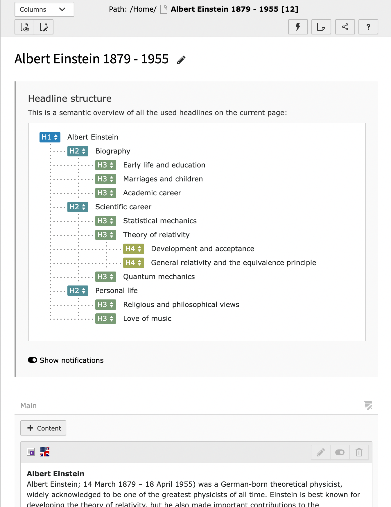

# The Semantilizer

## Simplify your semantic heading structure

The Semantilizer improves the SEO and accessibility of your TYPO3 Website and enhances your possibilities in creating
content. Extend the functionality of headlines with this easy-to-use tool that automatically validates and corrects your
heading structure.

Your content editors and your users will love it. Your SEO specialists and your designers will love it – and you’ll love
the Semantilizer, too, for sure!


## Installation

* Get the extension via composer: `composer require zeroseven/z7-semantilizer`
* Make sure the TypoScript setup gets included after the configuration of `fluid_styled_content` to override their
  partials for the headlines

## How it works

The Semantilizer divides the headline setup of website content elements into two different fields. By detaching the
semantic markup from the field `header_layout`, it becomes more simple and flexible for editors to e. g. change the font
size of a headline without changing its position in the headline hierarchy.


The Semantilizer provides real-time validation in the TYPO3 backend. It instantly notifies you about illogical headline
structures which can then automatically be fixed with just one click. Within the TYPO3 Page module, you can get a clear
overview of a page and its structure, and easily adjust the headline hierarchy using drag-and-drop.



### Validation

When displaying the headline structure of a page, the Semantilizer loads its frontend rather than just crawling
information from the database. That way, it automatically includes information from other extensions and backend layouts
– without any special configuration being necessary. It also includes headlines from RTE content and referenced content
elements. This feature makes the extension highly reliable and flexible, as the overview includes all headlines that can
possibly be there.

## Setup

### Render headlines

You’ll need to render your headlines via an extra ViewHelper in order to be able to edit or correct them automatically
in the backend overview. The `edit` attribute of the ViewHelper gives the Semantilizer all the necessary information
about the current headlines.

```html

<html xmlns:semantilzer="http://typo3.org/ns/Zeroseven/Semantilizer/ViewHelpers" data-namespace-typo3-fluid="true">

    <semantilzer:headline edit="{table: 'tt_content', uid: '{data.uid}', field: 'header_type'}" type="{data.header_type}">
        {data.header}
    </semantilzer:headline>

    <!-- Shorter syntax based on the syntax of TypoScript function getText:DB (https://docs.typo3.org/m/typo3/reference-typoscript/main/en-us/DataTypes/Properties/GetText.html#db) -->
    <semantilzer:headline edit="tt_content:{data.uid}:header_type" type="{data.header_type}">
        {data.header}
    </semantilzer:headline>

</html>
```

:bulb: _These infos will only be added to the headline if the editor is logged in to the TYPO3 backend and if the
request is made by the Semantilizer. Adding to that, a background check regarding the required editor access rights will
be made._

### Deactivate the Semantilizer

Let's take a detail page of the "news" extension: It can make sense to deactivate the Semantilizer. On a page like this,
you usually have different page content depending on parameters. Therefore you can disable the Semantilizer via TSconfig.

```tsconfig
tx_semantilizer.disabledPages := addToList(22)
```

The same configuration can be made for page types in general:

```tsconfig
tx_semantilizer.disabledDoktypes := addToList(33)
```

### Define validation areas

The Semantilizer checks the whole page `body` when standard settings are selected. If you want to have particular parts
of the page checked, this can be adjusted in TSconfig settings by providing the necessary `querySelector`:

```tsconfig
tx_semantilizer.contentSelectors := #main-content, .sidebar, div[role=banner]
```

### Connect headlines

Create logical connections between your headlines with the Semantilizer by assigning a `relationId` to a headline so
that others can connect to it. Now you can control their semantic markup either via the `ChildViewHelper` in a dynamic
hierarchical way (see example). Or you can use the `SiblingViewHelper` to unchangedly mirror the semantic markup on
connected headlines instead of making them hierarchical.

```html

<html xmlns:f="http://typo3.org/ns/TYPO3/CMS/Fluid/ViewHelpers" xmlns:semantilzer="http://typo3.org/ns/Zeroseven/Semantilizer/ViewHelpers" data-namespace-typo3-fluid="true">
    <semantilzer:headline type="{data.header_type}" relationId="product{data.uid}" class="content-header">{data.header}</semantilzer:headline>

    <f:for each="products" as="product">
        <div>
            <semantilzer:headline.child of="product{data.uid}" class="product-title">{product.header}</semantilzer:headline.child>
            <p>{product.description}</p>
        </div>
    </f:for>
</html>
```

:bulb: _As long as the `edit` attribute for the headline is set, there will be a standard fallback
of `[tablename]:[uid]` as `relationId`._

## Tips

If you want to make the labels of `header_layouts` more understandable, overwrite them like so:

```tsconfig
TCEFORM.tt_content {
    header_layout {
      removeItems = 2
      altLabels.. = Medium
      altLabels.1 = Larger
      altLabels.3 = Smaller
      addItems.pink_sparkling_bouncing_header = 🦄
    }
}
```

## Release notes:

### Version 3.0:

* Refactored JavaScript based headline validation
* Refactored backend overview
* Custom viewHelpers

### Version 2.1:

* Support multiple colPos (with ordering) depending on backend_layout

### Version 2.0:

* Refactoring of backend validation on PHP side
* Introduce dashboard widget for TYPO3 10 :tada:
* **Breaking change:** FixedTitleInterface has updated parameters, please adapt
